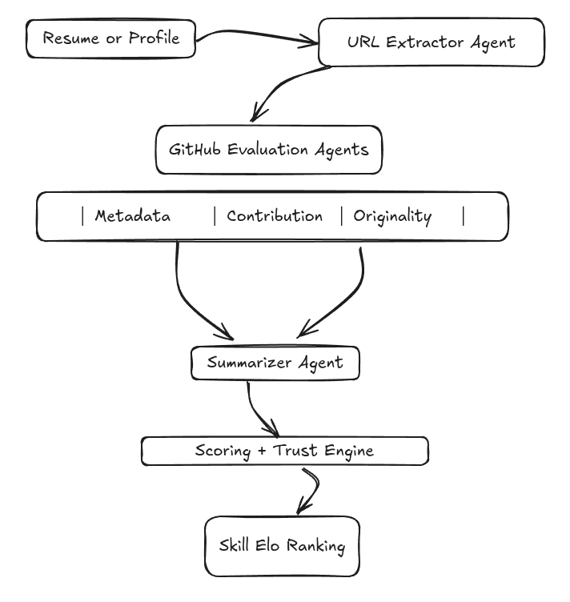

# CodeCredX – Multi-Agentic Resume Intelligence System

CodeCredX is a multi-agent system designed to evaluate candidates based on real contributions to code, not resume keywords. By crawling and analyzing all project-related URLs (such as GitHub, portfolios, blogs, or demos), it generates structured, verifiable proof-of-work reports and ranks candidates using an Elo-based system. This approach aims to replace traditional Applicant Tracking Systems (ATS) with a trustable, objective, and role-specific ranking mechanism.

---

## Key Features

| Feature                        | Description                                                                 |
|--------------------------------|-----------------------------------------------------------------------------|
| Multi-agentic Evaluation       | Modular pipeline of agents analyzing resume-linked artifacts independently |
| Resume Link Crawler            | Automatically extracts and follows project-related URLs from resumes        |
| GitHub Project Analysis        | Evaluates metadata, commit history, originality, and activity               |
| LLM-Powered Summarization      | Summarizes candidate projects using models like CodeBERT or GPT-4           |
| Depth-Aware Crawling           | Supports layered project analysis (README, code, APIs, blog posts)          |
| Trust Score Calculation        | Weighted score combining authorship, originality, and content strength      |
| Elo-Based Ranking              | Dynamically ranks all candidates relative to each other                     |
| Edge Case Handling             | Identifies forks, template-based projects, and AI-generated repositories    |
| Role-Based Ranking Pools       | Segregates candidates into frontend, ML, systems, etc., for fair comparison |

---

## Why CodeCredX

Most ATS platforms are built to filter resumes using keyword density and formatting. These are easily gamed and often fail to reflect actual ability or work quality. CodeCredX is designed for hiring teams that want to:

- Hire based on verified code contributions, not self-reported claims
- Automatically differentiate between original builders and template copiers
- Evaluate 100s–1000s of candidates without manual filtering
- Prioritize transparency, trust, and capability over buzzwords

---

## System Architecture



---

## Workflow

1. **Input Resume**: PDF, DOCX, or LinkedIn URL
2. **Extract Project URLs**: GitHub, blog posts, product demos
3. **Analyze Each Repo**:
   - Fetch metadata (stars, forks, topics)
   - Check originality (forked/template/copied)
   - Calculate contribution ratio via commit authorship
   - Summarize core code and README
4. **Score Projects**:
   - Trust Score = f(originality, contribution, LLM summary quality)
5. **Rank Candidates**:
   - Elo score updated through pairwise or sampled comparisons
6. **Output Report**:
   - JSON/Markdown report for recruiter
   - Leaderboard of top-ranked applicants

---

## Scoring & Ranking

### Trust Score

Each project is scored on a 0–100 scale based on:

- Originality of the codebase (not copied or forked)
- Contribution percentage by the candidate
- Summary insight (generated using LLM)
- Codebase quality (naming, modularity, documentation)

### Elo Score

- Initial Elo: Derived from Trust Score
- Elo updates: Pairwise comparison with other candidates
- Dynamic adjustment: As new resumes are added
- Result: Sorted leaderboard of most skilled candidates

---

## Example Output

```json
{
  "candidate": "utkarsh",
  "github": "https://github.com/pro-utkarshM",
  "trust_score": 83.5,
  "elo_score": 1478,
  "rank": 4,
  "projects": [
    {
      "repo": "custom-steganography-tool",
      "originality_score": 78.5,
      "contribution_score": 92.0,
      "summary": "A CLI tool for hiding encrypted text in image pixels using LSB manipulation and key-based decoding."
    }
  ]
}
````

---

## Edge Case Handling

CodeCredX is designed to handle common resume inflation techniques and irregularities:

* Forked projects with minimal change are penalized
* Copied templates are detected through similarity matching
* Repos without documentation fallback to code-level analysis
* GPT-generated or AI-invented projects are flagged using heuristics
* Obfuscated or minified codebases are marked low-confidence

---

## Scaling to 500+ Candidates

CodeCredX supports large applicant pools using:

* Sampling-based pairwise Elo updates
* Resume-level processing depth (0, 1, 2+)
* Persistent score and job queue storage
* Role-based ranking pools (frontend, backend, ML, blockchain)

---

<!-- ## Setup and Usage

### Requirements

* Python 3.8+
* Git, pip, and optionally Poetry
* HuggingFace Transformers, PyDriller, GitPython

### Installation

```bash
git clone https://github.com/your-username/CodeCredX
cd CodeCredX
pip install -e .
```

### Run (Single Candidate)

```bash
python main.py --resume resume.pdf --email user@example.com
```

### Outputs

* `trust_report.json`: Project analysis per candidate
* `ranked_candidates.csv`: Elo-sorted leaderboard

--- -->

## Roadmap

* GitHub OAuth login for candidate verification
* LangGraph orchestration for true multi-agent concurrency
* Recruiter feedback loop to influence Elo updates
* Frontend dashboard for browsing candidates and reports
* Role-specific scoring criteria (e.g., ML vs. frontend)
* Integration with Behance, Substack, Medium, and YouTube

---

## Contributing

Contributions are welcome. Please open an issue to discuss your idea first, or submit a pull request with a well-documented feature or fix.

---

## License

This project is open-sourced under the MIT License.

---

## Maintainer

Built by Utkarsh Maurya
GitHub: [@pro-utkarshM](https://github.com/pro-utkarshM)
